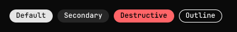
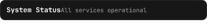
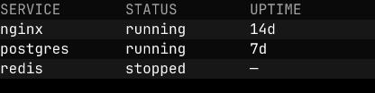
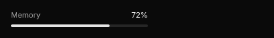

# Components

Auto-generated by `costae-docgen`. Do not edit by hand.

## Badge

**Module:** `@ui/badge`

**Shadcn reference:** https://ui.shadcn.com/docs/components/badge



A small inline label for status, category, or count.

### Usage

```jsx
<container tw="flex flex-row gap-[8px]">
  <Badge><text>Default</text></Badge>
  <Badge variant="secondary"><text>Secondary</text></Badge>
  <Badge variant="destructive"><text>Destructive</text></Badge>
  <Badge variant="outline"><text>Outline</text></Badge>
</container>
```

## Card

**Module:** `@ui/card`

**Shadcn reference:** https://ui.shadcn.com/docs/components/card



A styled container with rounded corners, a border, and card background colour.
Wraps arbitrary child nodes and accepts an optional `tw` prop for Tailwind overrides.

### Usage

```jsx
<Card tw="flex flex-col gap-[6px]">
  <CardHeader>
    <CardTitle><text>System Status</text></CardTitle>
    <CardDescription><text>All services operational</text></CardDescription>
  </CardHeader>
  <CardContent>
    <text tw="text-foreground text-[12px]">nginx · postgres · redis</text>
  </CardContent>
</Card>
```

## CardContent

**Module:** `@ui/card`

## CardDescription

**Module:** `@ui/card`

## CardFooter

**Module:** `@ui/card`

## CardHeader

**Module:** `@ui/card`

## CardTitle

**Module:** `@ui/card`

## DataTable

**Module:** `@ui/datatable`

**Shadcn reference:** https://ui.shadcn.com/docs/components/table



A data-driven table. Renders a header row followed by data rows with
alternating `bg-card` / `bg-muted/30` backgrounds. Columns map a `key`
(used to look up values in each row object) to a `label` (shown in the
header). An optional `width` constrains the column.

For full compositional control, use the `Table`, `TableHeader`, `TableBody`,
`TableRow`, `TableHead`, and `TableCell` primitives from `@ui/table` instead.

### Usage

```jsx
<DataTable
  columns={[{key:"service", label:"SERVICE"}, {key:"status", label:"STATUS"}, {key:"uptime", label:"UPTIME"}]}
  rows={[
    {service:"nginx", status:"running", uptime:"14d"},
    {service:"postgres", status:"running", uptime:"7d"},
    {service:"redis", status:"stopped", uptime:"—"},
  ]}
/>
```

## Progress

**Module:** `@ui/progress`

**Shadcn reference:** https://ui.shadcn.com/docs/components/progress



A horizontal progress bar. Renders a muted track with a filled segment
proportional to `value` (0–100). An optional `color` prop overrides the
fill colour; `tw` applies extra Tailwind classes to the track.

### Usage

```jsx
<container tw="flex flex-col gap-[6px] w-[200px]">
  <container tw="flex flex-row justify-between">
    <text tw="text-muted-foreground text-[11px]">Memory</text>
    <text tw="text-foreground text-[11px]">72%</text>
  </container>
  <Progress value={72} />
</container>
```

## Table

**Module:** `@ui/table`

**Shadcn reference:** https://ui.shadcn.com/docs/components/table


Composable table primitives. Use these to build fully custom table layouts.
For a data-driven table, use `DataTable` from `@ui/datatable` instead.

### Usage

```jsx
<Table>
  <TableHeader>
    <TableRow>
      <TableHead><text>SERVICE</text></TableHead>
      <TableHead><text>STATUS</text></TableHead>
      <TableHead><text>UPTIME</text></TableHead>
    </TableRow>
  </TableHeader>
  <TableBody>
    <TableRow>
      <TableCell><text>nginx</text></TableCell>
      <TableCell tw="text-green-500"><text>running</text></TableCell>
      <TableCell><text>14d</text></TableCell>
    </TableRow>
  </TableBody>
</Table>
```

## TableBody

**Module:** `@ui/table`

## TableCell

**Module:** `@ui/table`

## TableHead

**Module:** `@ui/table`

## TableHeader

**Module:** `@ui/table`

## TableRow

**Module:** `@ui/table`
