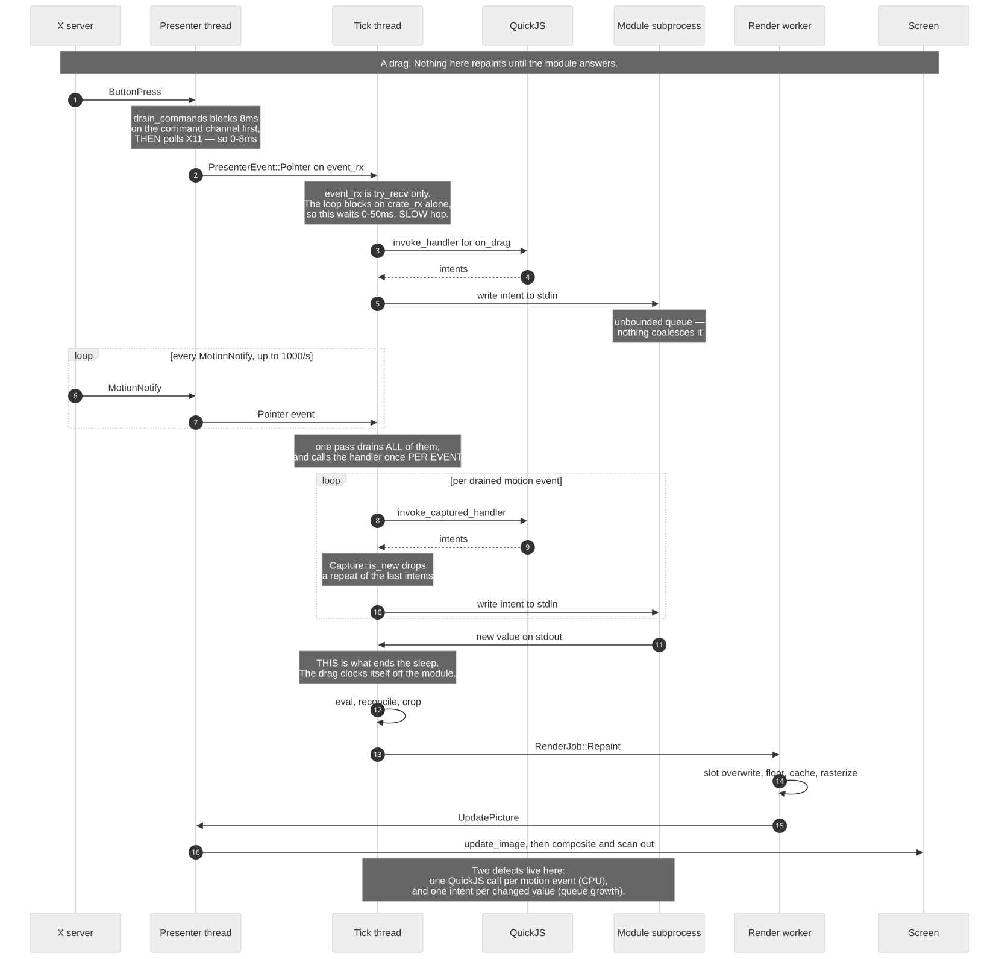

# Data flow, end to end

Every path data can take through tauler, from whatever caused it to the light leaving the
monitor. Repo-internal, like `docs/adr/` — none of this is published, and none of it is
something a person writing a layout file needs.

Latency classes are `CONTEXT.md`'s: **Negligible** 8ms, **Minimal** 10ms, **Slow** 100ms,
**Non-interactive** 400ms, and a Stacked budget per class for a whole path. Green nodes are
Negligible, yellow Minimal, orange Slow, purple Non-interactive, grey means nothing happens
there.

## 1. A stream value reaches the screen

The spine. Every other flow joins it somewhere.

Two things are worth reading off it. First, **a line that repeats changes nothing** — the
value is compared against the stored one before anything else happens, so a stream printing
the same number every second costs one comparison and no render. Second, **rasterizing is
the only Slow hop tauler controls**; everything upstream of the worker is Negligible, and
the only other Slow hop is the compositor's wait for vblank, which belongs to the display
server.

The stacked total lands inside the Slow budget of 200ms, and would still do so if
rasterization hit its 90ms worst case.

## 2. A drag reaches the screen

The one path where tauler's own structure, not the work, dominates.

Nothing here repaints directly. A pointer event produces *intents*, the module changes its
own state, and the new value comes back as an ordinary stream line — which is to say, this
diagram ends by joining diagram 1. A `<Slider>` cannot show a value the module has not
emitted; that is ADR 0012, not an oversight.

Two costs are visible:

- **The 0–50ms wait.** The tick loop blocks on `crate_rx` — subprocess stdout — and nothing
  else. `event_rx` is `try_recv` only, so a pointer event waits for whatever ends that
  sleep. A Slow hop whose entire job is servicing things that need Non-interactive at worst.
- **One QuickJS call per motion event.** A pass drains every motion event that accumulated
  and invokes the captured handler for each, at up to the mouse's report rate.

The loop is self-clocking after the first intent — the module's reply is what wakes the
next pass — so the rate is the round-trip rate, and falls back to 20Hz whenever the stepped
value does not change. That quantisation is the banding.

## 3. A finished frame reaches the glass

Where the three backends differ, and where they stop being tauler's business.

All three copy the framebuffer at least once on the way out: X11 into a fresh `Vec`, Wayland
into an SHM slot, macOS into a softbuffer with the channels swapped. Neither X11 nor Wayland
waits on a frame callback — tauler pushes as soon as the worker is done and the compositor
absorbs the timing. On X11 with no compositor running, the middle box disappears entirely.

## 4. Surfaces appearing, moving, resizing, going away

Which changes block the tick thread and which do not.

A repaint is fire-and-forget; everything else — a window's first frame, a resize, a
wallpaper paint — blocks the tick thread on a reply channel, because the caller cannot
proceed without the pixels. A wallpaper must block, since the panels above it are cropped
against what it just published.

The two guards at the bottom are both load-bearing. A blocking render clears that target's
slot, and the presenter still checks the frame's dimensions, because the worker and the tick
thread are two senders on one channel: a repaint that had *already started* when the resize
arrived has no ordering guarantee against it. See ADR 0023.

## 5. Everything else that can cause a frame

Seven causes that are neither a stream value nor a pointer event.

Most converge on the same eval-and-draw path. Three don't: a replaced binary re-execs the
process, and a dead subprocess is discovered by nothing at all — only the next supervision
pass notices it, which is the one job the loop's periodic wakeup genuinely exists for.

Note that a font change has to reach the worker explicitly. The cache belongs to the worker
now, so rebuilding the font context is not enough on its own — `RenderJob::FontsChanged` is
what makes it forget frames drawn with the old fonts.
