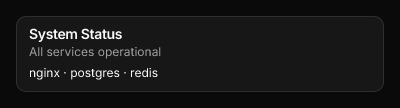
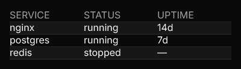
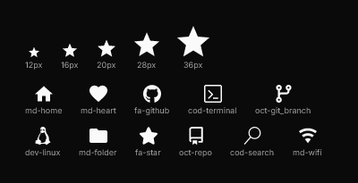
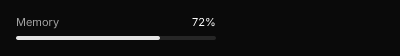
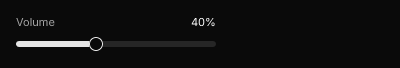
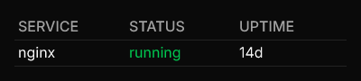

## Badge

**Module:** `@ui/badge`

**Shadcn reference:** https://ui.shadcn.com/docs/components/badge


A small inline label for status, category, or count.

### Usage

```jsx
import { Badge } from "@ui/badge";

<div class="flex flex-row gap-[8px]">
  <Badge><span>Default</span></Badge>
  <Badge variant="secondary"><span>Secondary</span></Badge>
  <Badge variant="destructive"><span>Destructive</span></Badge>
  <Badge variant="outline"><span>Outline</span></Badge>
</div>
```

## Card

**Module:** `@ui/card`

**Shadcn reference:** https://ui.shadcn.com/docs/components/card



A styled container with rounded corners, a border, and card background colour.
Wraps arbitrary child nodes and accepts an optional `class` attribute for Tailwind overrides.

### Usage

```jsx
import { Card, CardContent, CardDescription, CardHeader, CardTitle } from "@ui/card";

<Card class="flex flex-col gap-[6px]">
  <CardHeader>
    <CardTitle><span>System Status</span></CardTitle>
    <CardDescription><span>All services operational</span></CardDescription>
  </CardHeader>
  <CardContent>
    <span class="text-foreground text-[12px]">nginx · postgres · redis</span>
  </CardContent>
</Card>
```

## CardContent

**Module:** `@ui/card`

## CardDescription

**Module:** `@ui/card`

## CardFooter

**Module:** `@ui/card`

## CardHeader

**Module:** `@ui/card`

## CardTitle

**Module:** `@ui/card`

## DataTable

**Module:** `@ui/datatable`

**Shadcn reference:** https://ui.shadcn.com/docs/components/table



A data-driven table. Renders a header row followed by data rows with
alternating `bg-card` / `bg-muted/30` backgrounds. Columns map a `key`
(used to look up values in each row object) to a `label` (shown in the
header). An optional `width` constrains the column.

For full compositional control, use the `Table`, `TableHeader`, `TableBody`,
`TableRow`, `TableHead`, and `TableCell` primitives from `@ui/table` instead.

### Usage

```jsx
import { DataTable } from "@ui/datatable";

<DataTable
  columns={[{key:"service", label:"SERVICE"}, {key:"status", label:"STATUS"}, {key:"uptime", label:"UPTIME"}]}
  rows={[
    {service:"nginx", status:"running", uptime:"14d"},
    {service:"postgres", status:"running", uptime:"7d"},
    {service:"redis", status:"stopped", uptime:"—"},
  ]}
/>
```

## Icon

**Module:** `@ui/icon`



Renders a single Nerd Font glyph by icon name.

`name` uses the Nerd Fonts naming convention: `{family}-{icon}`,
e.g. `md-home`, `fa-github`, `cod-terminal`.
Full catalogue: [https://www.nerdfonts.com/cheat-sheet](https://www.nerdfonts.com/cheat-sheet)

Unknown names render as `?`.

### Usage

```jsx
import { Icon } from "@ui/icon";

<div class="flex flex-col gap-[16px] p-[12px]">
  <div class="flex flex-row items-end gap-[20px]">
    <div class="flex flex-col items-center gap-[4px]">
      <Icon name="md-star" class="text-[12px]" />
      <span class="text-[9px] text-muted-foreground">12px</span>
    </div>
    <div class="flex flex-col items-center gap-[4px]">
      <Icon name="md-star" class="text-[16px]" />
      <span class="text-[9px] text-muted-foreground">16px</span>
    </div>
    <div class="flex flex-col items-center gap-[4px]">
      <Icon name="md-star" class="text-[20px]" />
      <span class="text-[9px] text-muted-foreground">20px</span>
    </div>
    <div class="flex flex-col items-center gap-[4px]">
      <Icon name="md-star" class="text-[28px]" />
      <span class="text-[9px] text-muted-foreground">28px</span>
    </div>
    <div class="flex flex-col items-center gap-[4px]">
      <Icon name="md-star" class="text-[36px]" />
      <span class="text-[9px] text-muted-foreground">36px</span>
    </div>
  </div>
  <div class="flex flex-row flex-wrap gap-x-[20px] gap-y-[12px]">
    <div class="flex flex-col items-center gap-[4px]">
      <Icon name="md-home" class="text-[20px]" />
      <span class="text-[9px] text-muted-foreground">md-home</span>
    </div>
    <div class="flex flex-col items-center gap-[4px]">
      <Icon name="md-heart" class="text-[20px]" />
      <span class="text-[9px] text-muted-foreground">md-heart</span>
    </div>
    <div class="flex flex-col items-center gap-[4px]">
      <Icon name="fa-github" class="text-[20px]" />
      <span class="text-[9px] text-muted-foreground">fa-github</span>
    </div>
    <div class="flex flex-col items-center gap-[4px]">
      <Icon name="cod-terminal" class="text-[20px]" />
      <span class="text-[9px] text-muted-foreground">cod-terminal</span>
    </div>
    <div class="flex flex-col items-center gap-[4px]">
      <Icon name="oct-git_branch" class="text-[20px]" />
      <span class="text-[9px] text-muted-foreground">oct-git_branch</span>
    </div>
    <div class="flex flex-col items-center gap-[4px]">
      <Icon name="dev-linux" class="text-[20px]" />
      <span class="text-[9px] text-muted-foreground">dev-linux</span>
    </div>
    <div class="flex flex-col items-center gap-[4px]">
      <Icon name="md-folder" class="text-[20px]" />
      <span class="text-[9px] text-muted-foreground">md-folder</span>
    </div>
    <div class="flex flex-col items-center gap-[4px]">
      <Icon name="fa-star" class="text-[20px]" />
      <span class="text-[9px] text-muted-foreground">fa-star</span>
    </div>
    <div class="flex flex-col items-center gap-[4px]">
      <Icon name="oct-repo" class="text-[20px]" />
      <span class="text-[9px] text-muted-foreground">oct-repo</span>
    </div>
    <div class="flex flex-col items-center gap-[4px]">
      <Icon name="cod-search" class="text-[20px]" />
      <span class="text-[9px] text-muted-foreground">cod-search</span>
    </div>
    <div class="flex flex-col items-center gap-[4px]">
      <Icon name="md-wifi" class="text-[20px]" />
      <span class="text-[9px] text-muted-foreground">md-wifi</span>
    </div>
  </div>
</div>
```

## Progress

**Module:** `@ui/progress`

**Shadcn reference:** https://ui.shadcn.com/docs/components/progress



A horizontal progress bar. Renders a muted track with a filled segment
proportional to `value` (0–100). An optional `color` prop overrides the
fill colour; `class` applies extra Tailwind classes to the track.

### Usage

```jsx
import { Progress } from "@ui/progress";

<div class="flex flex-col gap-[6px] w-[200px]">
  <div class="flex flex-row justify-between">
    <span class="text-muted-foreground text-[11px]">Memory</span>
    <span class="text-foreground text-[11px]">72%</span>
  </div>
  <Progress value={72} />
</div>
```

## Slider

**Module:** `@ui/slider`

**Shadcn reference:** https://ui.shadcn.com/docs/components/slider



A horizontal slider. Draws `value` within `min`–`max`, and reports where you
press or drag.

It never remembers anything. `value` is read every tick from whatever owns it,
and `on_change` receives the value under the pointer and returns the intents to
send — one, or an array of them. Pressing counts as the first drag event, so a
plain click sets the value too.

```jsx
<Module bin="~/.cargo/bin/tauler-audio">
  {(data, events) => (
    <Slider
      value={data?.volume ?? 0}
      step={5}
      on_change={v => events.setVolume({ volume: v })}
    />
  )}
</Module>
```

The drag sets nothing locally: it sends intents, the module changes the volume,
and the next tick brings the new `value` back. Omit `on_change` and the slider
still renders — it is simply not interactive.

`min` defaults to 0, `max` to 100, and `step` to 1. `step` rounds the reported
value, which is also what keeps a drag from sending a message per pixel: a motion
that produces the intents just sent is skipped.

### Usage

```jsx
import { Slider } from "@ui/slider";

<div class="flex flex-col gap-[6px] w-[200px]">
  <div class="flex flex-row justify-between">
    <span class="text-muted-foreground text-[11px]">Volume</span>
    <span class="text-foreground text-[11px]">40%</span>
  </div>
  <Slider value={40} step={5} />
</div>
```

## Table

**Module:** `@ui/table`

**Shadcn reference:** https://ui.shadcn.com/docs/components/table



Composable table primitives. Use these to build fully custom table layouts.
For a data-driven table, use `DataTable` from `@ui/datatable` instead.

### Usage

```jsx
import { Table, TableBody, TableCell, TableHead, TableHeader, TableRow } from "@ui/table";

<Table>
  <TableHeader>
    <TableRow>
      <TableHead><span>SERVICE</span></TableHead>
      <TableHead><span>STATUS</span></TableHead>
      <TableHead><span>UPTIME</span></TableHead>
    </TableRow>
  </TableHeader>
  <TableBody>
    <TableRow>
      <TableCell><span>nginx</span></TableCell>
      <TableCell class="text-green-500"><span>running</span></TableCell>
      <TableCell><span>14d</span></TableCell>
    </TableRow>
  </TableBody>
</Table>
```

## TableBody

**Module:** `@ui/table`

## TableCell

**Module:** `@ui/table`

## TableHead

**Module:** `@ui/table`

## TableHeader

**Module:** `@ui/table`

## TableRow

**Module:** `@ui/table`

