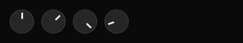

<link rel="stylesheet" href="/tauler/tauler.css" />

<script type="importmap">
{
  "imports": {
    "@ui/badge": "/tauler/ui/badge.js",
    "@ui/card": "/tauler/ui/card.js",
    "@ui/datatable": "/tauler/ui/datatable.js",
    "@ui/icon": "/tauler/ui/icon.js",
    "@ui/knob": "/tauler/ui/knob.js",
    "@ui/progress": "/tauler/ui/progress.js",
    "@ui/slider": "/tauler/ui/slider.js",
    "@ui/table": "/tauler/ui/table.js"
  }
}
</script>

## Badge

**Module:** `@ui/badge`

**Shadcn reference:** https://ui.shadcn.com/docs/components/badge

<div class="tauler-embed" data-tauler-example="badge"></div>

<div class="tauler-fallback">


</div>

A small inline label for status, category, or count.

### Usage

```jsx
import { Badge } from "@ui/badge";

<div class="flex flex-row gap-[8px]">
  <Badge><span>Default</span></Badge>
  <Badge variant="secondary"><span>Secondary</span></Badge>
  <Badge variant="destructive"><span>Destructive</span></Badge>
  <Badge variant="outline"><span>Outline</span></Badge>
</div>
```

## Card

**Module:** `@ui/card`

**Shadcn reference:** https://ui.shadcn.com/docs/components/card

<div class="tauler-embed" data-tauler-example="card"></div>

<div class="tauler-fallback">


</div>

A styled container with rounded corners, a border, and card background colour.
Wraps arbitrary child nodes and accepts an optional `class` attribute for Tailwind overrides.

### Usage

```jsx
import { Card, CardContent, CardDescription, CardHeader, CardTitle } from "@ui/card";

<Card class="flex flex-col gap-[6px]">
  <CardHeader>
    <CardTitle><span>System Status</span></CardTitle>
    <CardDescription><span>All services operational</span></CardDescription>
  </CardHeader>
  <CardContent>
    <span class="text-foreground text-[12px]">nginx · postgres · redis</span>
  </CardContent>
</Card>
```

## CardContent

**Module:** `@ui/card`

## CardDescription

**Module:** `@ui/card`

## CardFooter

**Module:** `@ui/card`

## CardHeader

**Module:** `@ui/card`

## CardTitle

**Module:** `@ui/card`

## DataTable

**Module:** `@ui/datatable`

**Shadcn reference:** https://ui.shadcn.com/docs/components/table

<div class="tauler-embed" data-tauler-example="datatable"></div>

<div class="tauler-fallback">


</div>

A data-driven table. Renders a header row followed by data rows with
alternating `bg-card` / `bg-muted/30` backgrounds. Columns map a `key`
(used to look up values in each row object) to a `label` (shown in the
header). An optional `width` constrains the column.

For full compositional control, use the `Table`, `TableHeader`, `TableBody`,
`TableRow`, `TableHead`, and `TableCell` primitives from `@ui/table` instead.

### Usage

```jsx
import { DataTable } from "@ui/datatable";

<DataTable
  columns={[{key:"service", label:"SERVICE"}, {key:"status", label:"STATUS"}, {key:"uptime", label:"UPTIME"}]}
  rows={[
    {service:"nginx", status:"running", uptime:"14d"},
    {service:"postgres", status:"running", uptime:"7d"},
    {service:"redis", status:"stopped", uptime:"—"},
  ]}
/>
```

## Icon

**Module:** `@ui/icon`

<div class="tauler-fallback">


</div>

Renders a single Nerd Font glyph by icon name.

`name` uses the Nerd Fonts naming convention: `{family}-{icon}`,
e.g. `md-home`, `fa-github`, `cod-terminal`.
Full catalogue: [https://www.nerdfonts.com/cheat-sheet](https://www.nerdfonts.com/cheat-sheet)

Unknown names render as `?`.

### Usage

```jsx
import { Icon } from "@ui/icon";

<div class="flex flex-col gap-[16px] p-[12px]">
  <div class="flex flex-row items-end gap-[20px]">
    <div class="flex flex-col items-center gap-[4px]">
      <Icon name="md-star" class="text-[12px]" />
      <span class="text-[9px] text-muted-foreground">12px</span>
    </div>
    <div class="flex flex-col items-center gap-[4px]">
      <Icon name="md-star" class="text-[16px]" />
      <span class="text-[9px] text-muted-foreground">16px</span>
    </div>
    <div class="flex flex-col items-center gap-[4px]">
      <Icon name="md-star" class="text-[20px]" />
      <span class="text-[9px] text-muted-foreground">20px</span>
    </div>
    <div class="flex flex-col items-center gap-[4px]">
      <Icon name="md-star" class="text-[28px]" />
      <span class="text-[9px] text-muted-foreground">28px</span>
    </div>
    <div class="flex flex-col items-center gap-[4px]">
      <Icon name="md-star" class="text-[36px]" />
      <span class="text-[9px] text-muted-foreground">36px</span>
    </div>
  </div>
  <div class="flex flex-row flex-wrap gap-x-[20px] gap-y-[12px]">
    <div class="flex flex-col items-center gap-[4px]">
      <Icon name="md-home" class="text-[20px]" />
      <span class="text-[9px] text-muted-foreground">md-home</span>
    </div>
    <div class="flex flex-col items-center gap-[4px]">
      <Icon name="md-heart" class="text-[20px]" />
      <span class="text-[9px] text-muted-foreground">md-heart</span>
    </div>
    <div class="flex flex-col items-center gap-[4px]">
      <Icon name="fa-github" class="text-[20px]" />
      <span class="text-[9px] text-muted-foreground">fa-github</span>
    </div>
    <div class="flex flex-col items-center gap-[4px]">
      <Icon name="cod-terminal" class="text-[20px]" />
      <span class="text-[9px] text-muted-foreground">cod-terminal</span>
    </div>
    <div class="flex flex-col items-center gap-[4px]">
      <Icon name="oct-git_branch" class="text-[20px]" />
      <span class="text-[9px] text-muted-foreground">oct-git_branch</span>
    </div>
    <div class="flex flex-col items-center gap-[4px]">
      <Icon name="dev-linux" class="text-[20px]" />
      <span class="text-[9px] text-muted-foreground">dev-linux</span>
    </div>
    <div class="flex flex-col items-center gap-[4px]">
      <Icon name="md-folder" class="text-[20px]" />
      <span class="text-[9px] text-muted-foreground">md-folder</span>
    </div>
    <div class="flex flex-col items-center gap-[4px]">
      <Icon name="fa-star" class="text-[20px]" />
      <span class="text-[9px] text-muted-foreground">fa-star</span>
    </div>
    <div class="flex flex-col items-center gap-[4px]">
      <Icon name="oct-repo" class="text-[20px]" />
      <span class="text-[9px] text-muted-foreground">oct-repo</span>
    </div>
    <div class="flex flex-col items-center gap-[4px]">
      <Icon name="cod-search" class="text-[20px]" />
      <span class="text-[9px] text-muted-foreground">cod-search</span>
    </div>
    <div class="flex flex-col items-center gap-[4px]">
      <Icon name="md-wifi" class="text-[20px]" />
      <span class="text-[9px] text-muted-foreground">md-wifi</span>
    </div>
  </div>
</div>
```

## Knob

**Module:** `@ui/knob`

<div class="tauler-embed" data-tauler-example="knob"></div>

<div class="tauler-fallback">



</div>

A rotary knob. Draws `value` as an angle in degrees — 0 points up, and the angle
increases clockwise — and reports the angle you turn it to.

It never remembers anything. `value` is read every tick from whatever owns it, and
`on_change` receives the new angle and returns the intents to send — one, or an
array of them.

```jsx
<Module bin="~/.cargo/bin/tauler-audio">
  {(data, events) => (
    <Knob
      value={data?.balance ?? 0}
      step={5}
      on_change={deg => events.setBalance({ deg })}
    />
  )}
</Module>
```

The turn sets nothing locally: it sends intents, the module changes the angle, and
the next tick brings the new `value` back. Omit `on_change` and the knob still
renders — it is simply not interactive.

There is no `min` and no `max`, because the knob measures how far you have turned
it rather than where on a scale you are pointing. Pressing it anywhere is a turn of
zero, so it never jumps to meet the pointer, and a fast flick and a slow drag that
end in the same place give the same angle.

The inner third is a hub that reports nothing. A bearing taken there is meaningless
— undefined at the exact centre, and swinging through tens of degrees per pixel
around it — so a press that lands in the hub, or a drag that wanders into it, is
ignored rather than allowed to leap. Turn it by the rim.

`value` and the reported angle have deliberately different domains. `value` is drawn
as given, so `450` and `-90` point where they say. What `on_change` reports is always
wrapped into 0–360, so turning past the top comes round rather than running off and a
module's stored number cannot drift out to thousands. What it cannot report is how
many whole turns you made — there is no scale for them to mean anything on.

`step` defaults to 1 and rounds the *turn*, not the angle it lands on. Rounding the
angle would move a press that has not travelled at all, and would shift the grid a
little further every lap for a step that does not divide a circle. Rounding is also
what keeps a turn from sending a message per pixel: a motion that produces the
intents just sent is skipped.

### Usage

```jsx
import { Knob } from "@ui/knob";

<div class="flex flex-row gap-[12px] items-center">
  <Knob value={0} />
  <Knob value={45} />
  <Knob value={135} />
  <Knob value={250} />
</div>
```

## Progress

**Module:** `@ui/progress`

**Shadcn reference:** https://ui.shadcn.com/docs/components/progress

<div class="tauler-embed" data-tauler-example="progress"></div>

<div class="tauler-fallback">


</div>

A horizontal progress bar. Renders a muted track with a filled segment
proportional to `value` (0–100). An optional `color` prop overrides the
fill colour; `class` applies extra Tailwind classes to the track.

### Usage

```jsx
import { Progress } from "@ui/progress";

<div class="flex flex-col gap-[6px] w-[200px]">
  <div class="flex flex-row justify-between">
    <span class="text-muted-foreground text-[11px]">Memory</span>
    <span class="text-foreground text-[11px]">72%</span>
  </div>
  <Progress value={72} />
</div>
```

## Slider

**Module:** `@ui/slider`

**Shadcn reference:** https://ui.shadcn.com/docs/components/slider

<div class="tauler-embed" data-tauler-example="slider"></div>

<div class="tauler-fallback">


</div>

A horizontal slider. Draws `value` within `min`–`max`, and reports where you
press or drag.

It never remembers anything. `value` is read every tick from whatever owns it,
and `on_change` receives the value under the pointer and returns the intents to
send — one, or an array of them. Pressing counts as the first drag event, so a
plain click sets the value too.

```jsx
<Module bin="~/.cargo/bin/tauler-audio">
  {(data, events) => (
    <Slider
      value={data?.volume ?? 0}
      step={5}
      on_change={v => events.setVolume({ volume: v })}
    />
  )}
</Module>
```

The drag sets nothing locally: it sends intents, the module changes the volume,
and the next tick brings the new `value` back. Omit `on_change` and the slider
still renders — it is simply not interactive.

`min` defaults to 0, `max` to 100, and `step` to 1. `step` rounds the reported
value, which is also what keeps a drag from sending a message per pixel: a motion
that produces the intents just sent is skipped.

The example below names a module, `tauler-demo-volume`, that you will not have —
pasted as it stands it renders a slider that does not move. It names one anyway,
because a slider with a literal `value` and no source would show you a control
holding its own state, which is the one thing this component does not do. On this
page the module is a few lines of JavaScript in the browser rather than a
subprocess; the layout file cannot tell the difference, and that is the point.

### Usage

```jsx
import { Slider } from "@ui/slider";

const events = useEvents("tauler-demo-volume");
const volume = Number(useStringStream("tauler-demo-volume")) || 40;

return (
  <div class="flex flex-col gap-[6px] w-[200px]">
    <div class="flex flex-row justify-between">
      <span class="text-muted-foreground text-[11px]">Volume</span>
      <span class="text-foreground text-[11px]">{volume}%</span>
    </div>
    <Slider value={volume} step={5} on_change={(v) => events.set({ value: v })} />
  </div>
);
```

## Table

**Module:** `@ui/table`

**Shadcn reference:** https://ui.shadcn.com/docs/components/table

<div class="tauler-embed" data-tauler-example="table"></div>

<div class="tauler-fallback">


</div>

Composable table primitives. Use these to build fully custom table layouts.
For a data-driven table, use `DataTable` from `@ui/datatable` instead.

### Usage

```jsx
import { Table, TableBody, TableCell, TableHead, TableHeader, TableRow } from "@ui/table";

<Table>
  <TableHeader>
    <TableRow>
      <TableHead><span>SERVICE</span></TableHead>
      <TableHead><span>STATUS</span></TableHead>
      <TableHead><span>UPTIME</span></TableHead>
    </TableRow>
  </TableHeader>
  <TableBody>
    <TableRow>
      <TableCell><span>nginx</span></TableCell>
      <TableCell class="text-green-500"><span>running</span></TableCell>
      <TableCell><span>14d</span></TableCell>
    </TableRow>
  </TableBody>
</Table>
```

## TableBody

**Module:** `@ui/table`

## TableCell

**Module:** `@ui/table`

## TableHead

**Module:** `@ui/table`

## TableHeader

**Module:** `@ui/table`

## TableRow

**Module:** `@ui/table`


<script type="module">
  import { boot, Mount, registerTransport, setStreamValue } from '/tauler/runtime.js'

  globalThis.__taulerErrors = []
  const mounts = [...document.querySelectorAll('.tauler-embed')]
  if (mounts.length) {
    try {
      await boot('/tauler/tauler_web_bg.wasm')

      // A Module, implemented in the page instead of as a subprocess.
      //
      // It is what makes the Slider example on this page work, and it is the whole
      // demonstration: the layout file says `useEvents("tauler-demo-volume")` and
      // `useStringStream("tauler-demo-volume")` and cannot tell whether the other end is
      // a process, a worker, an SSH connection or these four lines. A Transport is
      // whatever fills the map and takes the intents.
      registerTransport('tauler-demo-volume', (event) => {
        if (event?.type === 'set') setStreamValue('tauler-demo-volume', null, event.value)
      })

      for (const el of mounts) {
        const name = el.dataset.taulerExample
        const { default: render } = await import(`/tauler/examples/${name}.js`)
        new Mount(el, render).tick()
        el.parentElement.querySelector('.tauler-fallback')?.setAttribute('hidden', '')
      }
    } catch (e) {
      globalThis.__taulerErrors.push(String((e && e.stack) || e))
      console.warn('tauler: falling back to screenshots', e)
    }
  }
</script>
