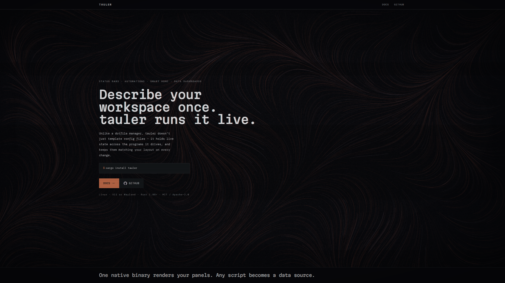
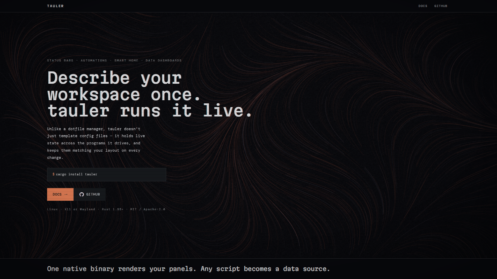
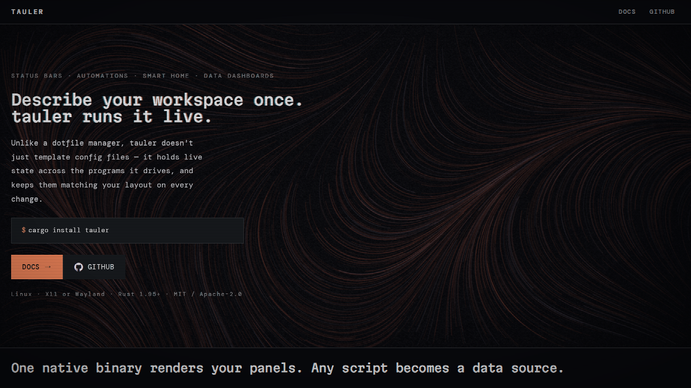
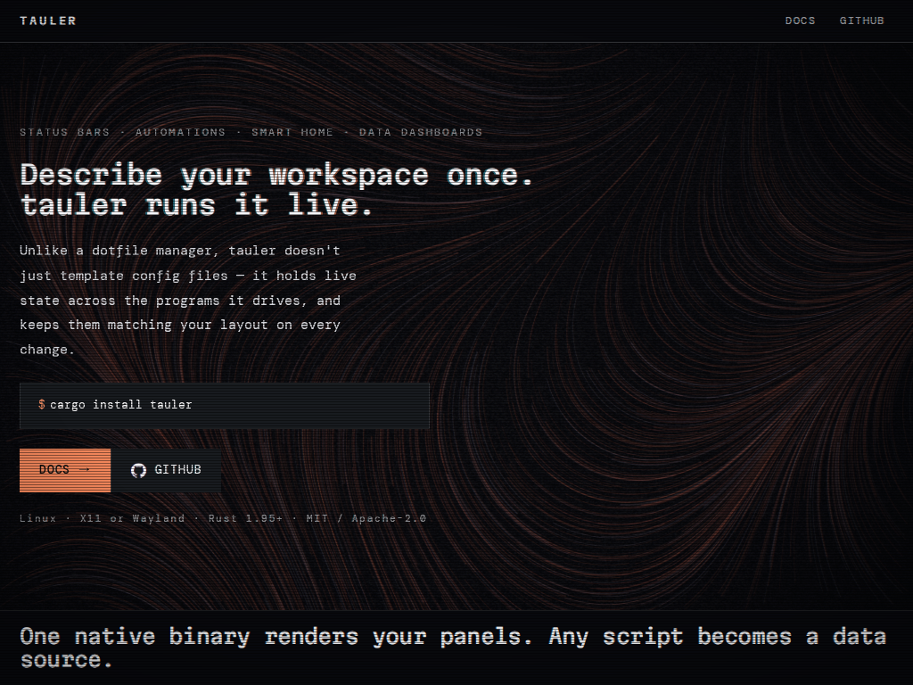
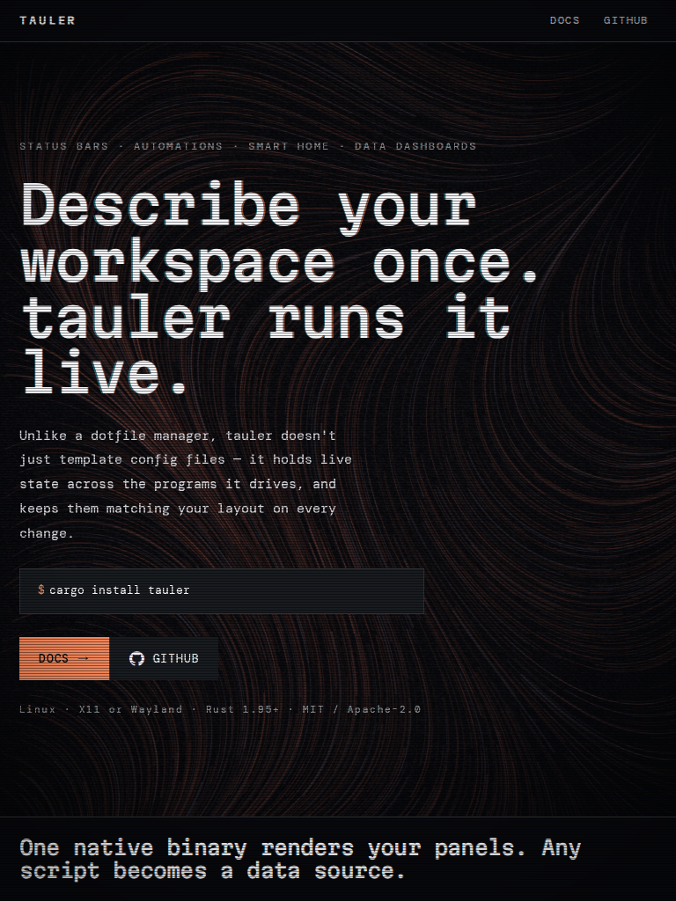
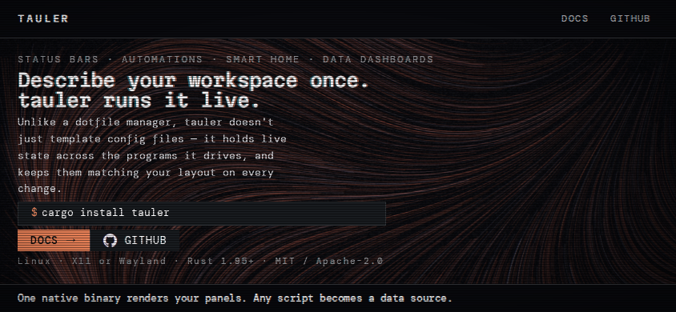
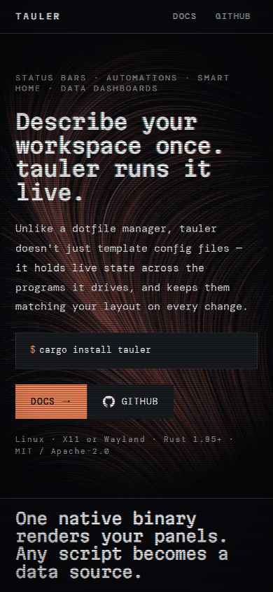

**Source:** `docs/tests/landing.spec.ts`

**Regenerate:** `pnpm run test:update` (from `docs/`) — runs the suite inside the pinned
Playwright container (ADR 0031) and copies the resulting baselines here.

One screenshot per breakpoint `landing.spec.ts` tests against.

